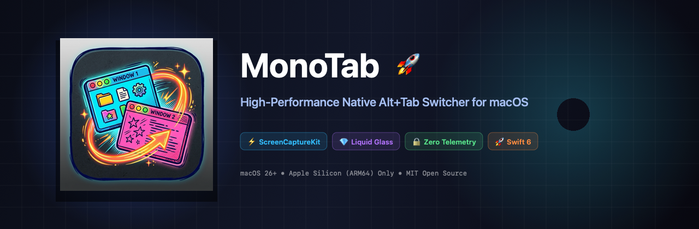
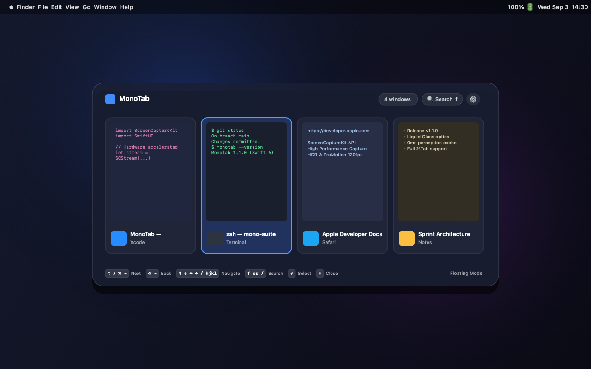
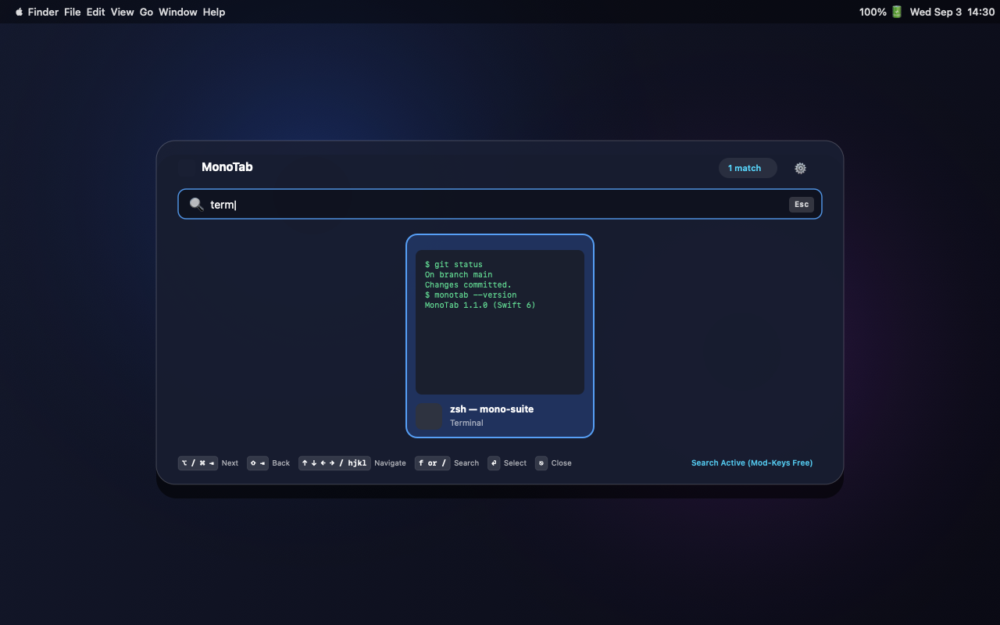

# MonoTab 🚀

<p align="center">
  
</p>

<p align="center">
  <a href="https://github.com/JoaoOliveira889/MonoTab/releases"></a>
  <a href="https://apple.com/macos"></a>
  <a href="https://swift.org"></a>
  
  
  <a href="docs/SECURITY.md"></a>
  <a href="LICENSE"></a>
</p>

---

## 📖 Overview

**MonoTab** is a high-performance, native macOS **Alt+Tab** window switcher engineered with **Swift 6** and **SwiftUI**. It delivers instantaneous window cycling with hardware-accelerated preview thumbnails via **ScreenCaptureKit**, fluid **Liquid Glass** optics, full keyboard navigation (including Vim `hjkl`), and an uncompromising **zero-telemetry, zero-network** privacy architecture.

Free and open-source software under the **MIT License**.

---

## 📸 Visual Previews

### Centered Liquid Glass HUD (Floating Mode)


### Search Mode (`f` or `/`) with Non-Closing Modifiers


---

## ✨ Features

- **Centered Liquid Glass HUD**:
  - Transparent backdrop preserving visibility of your underlying wallpaper and workspaces.
  - Mathematically centered layout with dual-layer optical refraction, dynamic ambient blur, and specular rim lighting.
- **ScreenCaptureKit Hardware Acceleration**:
  - Captured directly at card resolution, sized per window to its own aspect ratio (bounded by 560x352), using Apple Silicon media decoders without allocating large 4K/5K textures.
  - Parallel background capture across CPU/GPU cores using asynchronous Swift tasks.
- **0ms Perceived Latency (`ThumbnailStore`)**:
  - In-memory ephemeral cache displays previews from prior switching sessions instantly upon pressing the hotkey.
  - Strictly RAM-only; closed windows are automatically purged from memory.
- **Flexible Shortcut Activation (`⌥ Tab` & `⌘ Tab`)**:
  - Choose between `⌥ Option + Tab`, `⌘ Command + Tab` (replacing macOS default application switcher), or **Both**.
  - Immediate forward cycling targets the most recent window first (`selectedIndex = 1`).
- **Non-Closing Search Mode (`f` or `/`)**:
  - Press `f` or `/` during navigation to open search immediately.
  - Releasing modifier keys (⌥ / ⌘) in search mode **keeps MonoTab open**, allowing natural two-handed typing.
  - Press `Escape` to clear search or exit; press `Enter` to focus the matched window.
- **Menu Bar Item**:
  - Reaches Preferences and Quit even when the Accessibility permission that powers the hotkey is missing. Can be hidden from Preferences.
- **Fuzzy Search**:
  - Subsequence matching with scoring — `vsc` finds `Visual Studio Code`. Results are ranked, so the best match sits under the initial selection.
- **Quit an App (`⌘Q`)**:
  - Sends the standard Quit Apple Event to the selected window's application, so it still gets to prompt about unsaved work.
- **Instant Window Close (`w`)**:
  - Close background or active windows directly from the switcher grid using the `w` key or the hover close button (`×`), without needing to switch to the window first.
- **Launch at Login**:
  - Native auto-start toggle integrated directly with macOS `SMAppService` and System Settings.
- **Floating & Fullscreen Modes**:
  - Toggle between a centered, spacious floating HUD and an expanded fullscreen grid.
- **Minimized Window Support**:
  - Optionally view and restore windows minimized to the macOS Dock.
- **Vim Navigation (`hjkl`) & Arrow Keys**:
  - Move across the window grid effortlessly using standard arrow keys or Vim bindings (`h`, `j`, `k`, `l`).
- **100% Local & Private**:
  - No internet connections, no telemetry, no tracking SDKs, no disk logs, and no keystroke logging.

---

## ⚙️ System Requirements & Compatibility
 
| Requirement | Minimum Supported Version |
| :--- | :--- |
| **Operating System** | macOS 26.0+ (Latest macOS Release) |
| **Architecture** | Apple Silicon only (`arm64` native: M1, M2, M3, M4, Pro/Max/Ultra and later) |
| **Display Support** | Native ProMotion 120Hz, Retina, HDR, and Multi-Monitor |
| **Build Tools** *(source)* | Swift 6.0+ and Xcode 16.0+ / macOS 26 SDK |

---

## 🛠️ How to Install & Run

### 1. Build and Install via Makefile (Recommended)

Clone the repository and run the automated installation target:

```bash
git clone https://github.com/JoaoOliveira889/MonoTab.git
cd MonoTab
make install
```

What `make install` does:
1. Compiles the project in release mode using Swift 6 (`swift build -c release`).
2. Packages `MonoTab.app` with icons, metadata, and hardened runtime entitlements.
3. Signs the bundle locally with codesign.
4. Copies `MonoTab.app` to `/Applications`.
5. Creates CLI symlinks in `~/.local/bin/MonoTab` and `~/.local/bin/monotab`.
6. Launches the newly installed application.

### 2. Launching MonoTab

- **From Terminal**:
  ```bash
  monotab
  # or:
  MonoTab
  ```
- **From Finder / Spotlight / Raycast / Alfred**:
  Search for `MonoTab` and press Return.

### 3. Running Automated Tests

```bash
make test
```

### 4. Standalone Bundle Creation

If you only wish to produce `MonoTab.app` in the repository root without installing it system-wide:

```bash
make app
```

---

## 🔒 Permissions Setup

MonoTab requires two standard macOS permissions:

1. **Accessibility**: Allows capturing the global `⌥ Tab` / `⌘ Tab` hotkey and focusing application windows.
2. **Screen Recording**: Allows capturing real-time window preview thumbnails via Apple's ScreenCaptureKit API.

When MonoTab opens for the first time, a setup banner will guide you to enable each permission under **System Settings → Privacy & Security**.

👉 For troubleshooting and step-by-step instructions, see the [Permissions Guide](docs/PERMISSIONS.md).

---

## ⌨️ Keyboard Shortcuts Reference

| Shortcut | Context | Action |
| :--- | :--- | :--- |
| **`⌥ Tab`** or **`⌘ Tab`** | System-wide | Open MonoTab and cycle to next window |
| **`⇧ + ⇥`** *(Shift + Tab)* | Switcher visible | Cycle to previous window |
| **Release `⌥` / `⌘`** | Switcher visible | Confirm selection and focus window immediately |
| **`w`** | Switcher visible | Close selected window via Accessibility API |
| **`⌘ Q`** | Switcher visible | Quit selected application via Apple Event |
| **`f`** or **`/`** | Switcher visible | Enter Search Mode (keeps window open without holding keys) |
| **`↑ ↓ ← →`** | Switcher visible | Navigate window grid |
| **`h j k l`** | Switcher visible | Vim navigation (Left, Down, Up, Right) |
| **`⏎`** *(Enter)* | Switcher / Search | Focus selected window and close switcher |
| **`⎋`** *(Escape)* | Switcher visible | Dismiss switcher / Exit search mode / Close settings |
| **`⌘ ,`** | Switcher visible | Open Preferences modal |

---

## 📚 Technical Documentation

Explore the detailed architecture, security audit, and permission references:

- [Architecture & Technical Design](docs/ARCHITECTURE.md): Pipeline breakdown of ScreenCaptureKit, CGEventTap, and in-memory caching.
- [Security & Privacy Audit Report](docs/SECURITY.md): Reproducible commands to verify zero network symbols, hardened runtime flags, entitlements, and socket absence.
- [Privacy Manifesto (Português)](PRIVACY.md): Termo de compromisso de privacidade e auditoria local.
- [Permissions Troubleshooting](docs/PERMISSIONS.md): Diagnostic guide for macOS Accessibility and Screen Recording permissions.

---

## 🎨 Design Assets

Vector and high-resolution assets are available in the [`img/`](img/) directory:
- [`img/icon.svg`](img/icon.svg): Scalable vector SVG of the 1980s retro CRT app icon.
- [`img/logo.png`](img/logo.png): Master 512x512 PNG app icon.
- [`img/banner.png`](img/banner.png): Official project banner.
- [`img/preview.png`](img/preview.png): Centered Liquid Glass HUD mockup.
- [`img/preview-search.png`](img/preview-search.png): Search Mode mockup.

To regenerate iconsets and visual assets:
```bash
DEVELOPER_DIR=/Applications/Xcode.app/Contents/Developer swift scripts/generate_assets.swift
```

---

## 📄 License

This project is open-source software licensed under the **MIT License**. See [LICENSE](LICENSE) for details.
